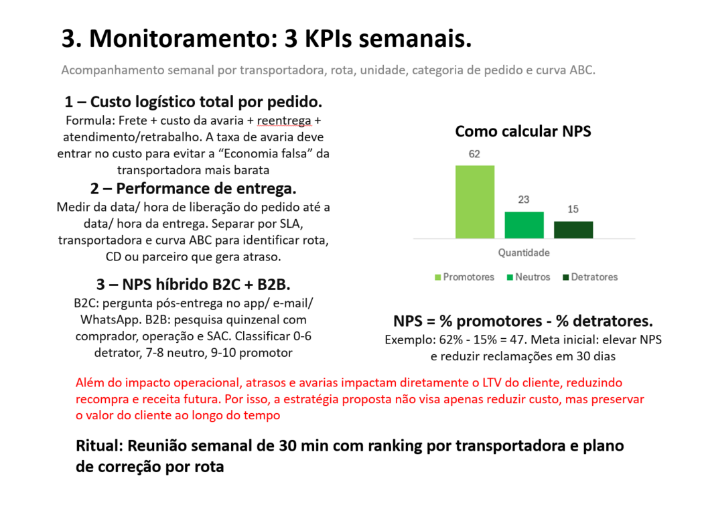
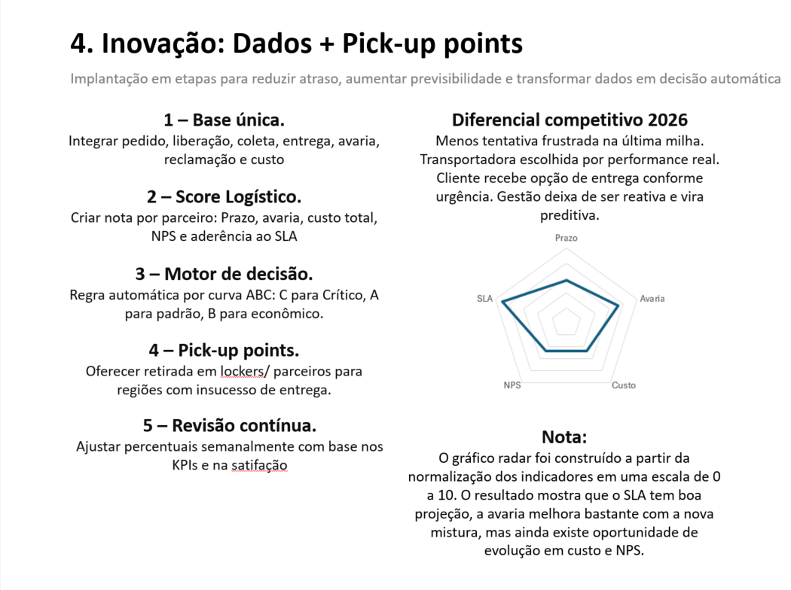

# 📦 Case Logístico — Alpha Log

Case técnico desenvolvido com foco em otimização operacional, redução de custo logístico total e melhoria do nível de serviço em operação de e-commerce.

---

# 🎯 Objetivo do Case

O objetivo deste projeto foi analisar um cenário operacional com aumento de reclamações por atraso e crescimento do custo médio de frete, propondo uma solução estratégica baseada em performance logística, SLA e custo total da operação.

A proposta foi construída considerando fatores como:

- Prazo real de entrega
- Taxa de avaria
- Custo oculto operacional
- Nível de serviço
- Experiência do cliente
- Performance por transportadora

---

# 📊 Cenário Analisado

A operação apresentava:

📈 +15% de aumento nas reclamações  
📈 +8% de aumento no custo médio de frete  

A análise identificou que o principal problema não era apenas o custo do frete, mas sim o impacto operacional causado por atrasos, avarias, retrabalho e reentregas.

---

# 🚚 Estratégia Proposta

Foi desenvolvida uma redistribuição operacional utilizando lógica de Curva ABC para segmentar pedidos conforme:

- Criticidade do cliente
- SLA
- Prazo real
- Risco de avaria
- Custo logístico total

Distribuição sugerida:

✅ 55% Transportadora A  
✅ 30% Transportadora C  
✅ 15% Transportadora B  

---

# 📈 KPIs Monitorados

- SLA operacional
- Prazo médio de entrega
- Taxa de avaria
- NPS logístico
- Custo logístico total por pedido
- Performance por transportadora
- Reclamações operacionais

---

# 💡 Diferenciais do Projeto

✅ Análise de custo oculto operacional  
✅ Estratégia baseada em custo total e não apenas frete  
✅ Aplicação de Curva ABC logística  
✅ Proposta de score logístico por parceiro  
✅ Estrutura de monitoramento semanal  
✅ Visão preditiva para tomada de decisão  

---

# 🚀 Inovação Proposta

O projeto também propõe:

- Score logístico automatizado
- Motor de decisão operacional
- Redistribuição automática de volume
- Uso de pick-up points
- Revisão contínua baseada em KPIs

---

# 🛠️ Ferramentas Utilizadas

- Excel
- PowerPoint
- Indicadores Logísticos
- Curva ABC
- Análise de SLA
- Estratégia Operacional

---

# 🖼️ Apresentação do Case

## 📌 Plano de Ação

---

## 📊 Monitoramento Operacional

---

## 🚀 Inovação e Estratégia

---

## ✅ Fechamento do Plano

---

# 🔒 Observação

Projeto desenvolvido para estudo de caso técnico com finalidade educacional e de portfólio profissional.
